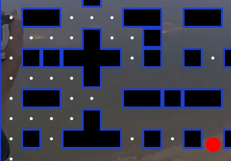

# 🎮 Pacman Game

A classic Pacman game built with vanilla JavaScript and HTML5 Canvas. Navigate through mazes, collect pellets, avoid ghosts, and beat all levels!



## ✨ Features

- **Classic Pacman Gameplay** - Navigate through mazes and collect all pellets to advance
- **2 Progressive Levels** - Increasing difficulty with more ghosts and faster speeds (easily expandable!)
- **Multiple Ghosts** - Face off against 2-4 ghosts depending on the level
- **Power-Ups** - Collect power pellets to temporarily turn ghosts blue and eat them
- **Lives System** - Start with 3 lives, respawn when caught by ghosts
- **Score Tracking** - Persistent high score saved in browser localStorage
- **Pause/Resume** - Press Space to pause the game at any time
- **Responsive Controls** - Smooth keyboard arrow key movement
- **Custom Maze Design** - Classic Pacman-style mazes with strategic obstacles

## 🎯 How to Play

### Controls
- **Arrow Keys** - Move Pacman (Up, Down, Left, Right)
- **Space** - Pause/Resume game
- **R** - Restart game

### Objective
- Collect all pellets (white dots) to complete each level
- Avoid ghosts (they will take one of your lives)
- Collect power-ups (yellow dots) to make ghosts vulnerable for 5 seconds
- Eat vulnerable (blue) ghosts for bonus points
- Complete all levels to win!

### Scoring
- Pellet: 10 points
- Ghost: 50 points
- Complete all pellets to advance to the next level

## 🚀 Getting Started

### Prerequisites
- A modern web browser (Chrome, Firefox, Safari, Edge)
- No additional dependencies required!

### Installation

1. Clone the repository:
```bash
git clone https://github.com/yourusername/pacman-game.git
cd pacman-game
```

2. Open `index.html` in your web browser:
```bash
# On Linux
xdg-open index.html

# On macOS
open index.html

# On Windows
start index.html
```

Or simply drag and drop `index.html` into your browser.

That's it! The game will start immediately.

## 📁 Project Structure

```
pacman-game/
├── index.html          # Main HTML file
├── index.js            # Game logic and mechanics
├── css/
│   └── style.css       # Styles (if using external CSS)
├── images/             # Game sprites and graphics
│   ├── pipeHorizontal.png
│   ├── pipeVertical.png
│   ├── pipeCorner1-4.png
│   ├── block.png
│   ├── capLeft/Right/Top/Bottom.png
│   └── ...
├── M@D.jpg            # Background image
└── README.md          # This file
```

## 🎨 Technical Details

### Built With
- **HTML5** - Structure and Canvas element
- **CSS3** - Styling and layout
- **JavaScript (ES6)** - Game logic and rendering
- **Canvas API** - 2D graphics rendering

### Key Features
- Object-oriented design with ES6 classes (Player, Ghost, Pellet, PowerUp, Boundary)
- Collision detection using circle-rectangle collision algorithm
- Ghost AI with random pathfinding
- LocalStorage for persistent high scores
- RequestAnimationFrame for smooth 60fps animation
- Progressive difficulty scaling (ghost speed increases per level)

### Game Constants
```javascript
PLAYER_SPEED = 5        // Pacman movement speed
GHOST_SPEED = 2         // Base ghost speed (increases per level)
PELLET_POINTS = 10      // Points per pellet
GHOST_POINTS = 50       // Points per ghost
POWER_UP_DURATION = 5000ms  // Power-up effect duration
INITIAL_LIVES = 3       // Starting lives
```

## 🎮 Level Design

The game features 2 handcrafted levels (easily expandable!):

- **Level 1**: 2 ghosts, normal speed - Your original classic maze design
- **Level 2**: 3 ghosts, 1.3x speed - More obstacles and increased challenge

**Adding more levels is simple!** Just copy an existing level in the `levels` array and modify it.

Each level uses a grid-based design with various wall pieces and obstacles:
- Border walls (corners, horizontal, vertical)
- Block obstacles
- Cap structures (decorative barriers)
- Strategic power-up placement

## 📝 Adding New Levels

To add new levels, simply add a new 2D array to the `levels` array in `index.js`:

```javascript
const levels = [
  // Level 1
  [...],
  // Level 2
  [...],
  // Your new level (30x15 grid)
  [
    ['1', '-', '-', ... , '2'],
    ['|', '.', '.', ... , '|'],
    // ... more rows
    ['4', '-', '-', ... , '3']
  ]
]
```

### Map Symbols
- `1,2,3,4` - Corner pieces
- `-` - Horizontal wall
- `|` - Vertical wall
- `b` - Block obstacle
- `[,],^,_` - Cap pieces
- `+` - Cross connector
- `5,7` - Pipe connectors
- `.` - Pellet
- `p` - Power-up
- ` ` - Empty space (no pellet)

## 🐛 Known Issues

None at the moment! Feel free to report any bugs in the Issues section.

## 🤝 Contributing

Contributions, issues, and feature requests are welcome!

1. Fork the project
2. Create your feature branch (`git checkout -b feature/AmazingFeature`)
3. Commit your changes (`git commit -m 'Add some AmazingFeature'`)
4. Push to the branch (`git push origin feature/AmazingFeature`)
5. Open a Pull Request

## 📜 License

This project is licensed under the MIT License - see the [LICENSE](LICENSE) file for details.

## 👏 Credits

- Game Design: Inspired by the classic Pacman arcade game
- Powered by [Kixx-Customs.Net](https://www.Kixx-Customs.net)
- Graphics: Custom pipe and maze graphics

## 🎯 Future Enhancements

- [ ] Add sound effects and background music
- [ ] Mobile touch controls
- [ ] More levels
- [ ] Different maze themes
- [ ] Ghost personality AI (like original Pacman)
- [ ] Fruit bonus items
- [ ] Leaderboard system
- [ ] Difficulty settings

---

Made with ❤️ and JavaScript | [Report Bug](../../issues) | [Request Feature](../../issues)
